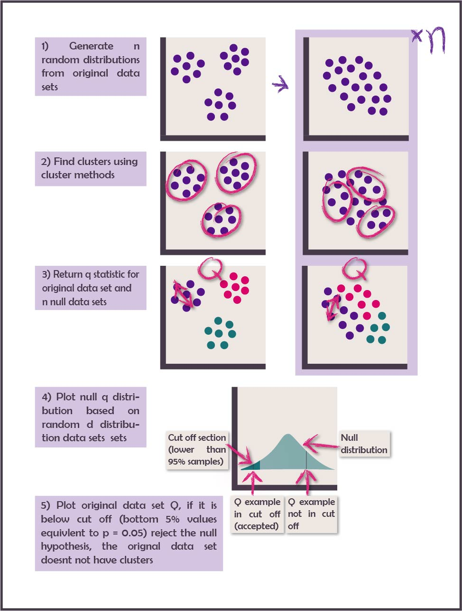
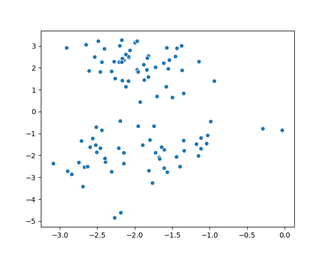
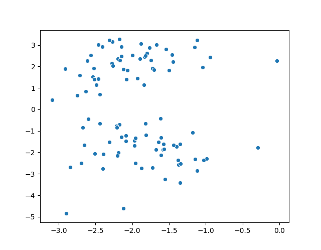
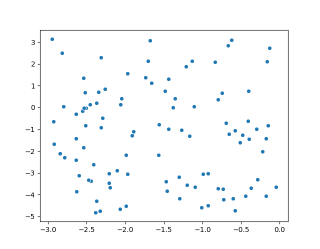
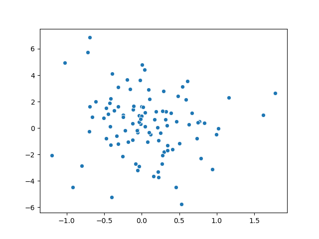

```{r setup, include=FALSE}
knitr::opts_chunk$set(echo = TRUE)
library(knitr)
library(tidyr)
library(dplyr)
library(data.table)
library(magrittr)
library(ggplot2)
library(reshape2)
library(gridExtra)
library(lattice)
library(extrafont)
library(stringr)
tp_sense <- fread('./sand_box/out_data/sense_final.csv', drop = 1)
tp_only <- fread('./sand_box/out_data/only.csv', drop = 1)
tp_pval <- fread('./sand_box/out_data/pval.csv', drop = 1)
tp_clust <- fread('./sand_box/out_data/clust.csv', drop = 1)
tp_acru <- fread('./sand_box/out_data/tp_acru.csv', drop = 1)
tp_count <- fread('./sand_box/out_data/count.csv', drop = 1)
cols <- c('#453a49','#541388','#d90368','#197278','#c3a995')
grad_cols <- c('#453a49','#541388', '#601286', '#6b1284', '#751482', '#7e1681', '#86197f', '#8e1c7e', '#95217d', '#9b267d', '#a12b7c', '#a7307c', '#ac367b', '#b13c7b', '#b5427c', '#b9487c', '#bd4e7d', '#c0557d', '#c35c7e', '#c5627f', '#c76980', '#c97082', '#ca7784', '#ca7e85', '#ca8588', '#ca8c8a', '#c9938c', '#c89a8f', '#c6a292', '#c3a995')
```
## Introduction 

### Overview
There exist many tools to evaluate clusters resulting from patient subtyping studies, however 
the question is never asked whether the data being clustered actually contains clusters. This 
is an important question as many commenly used clustering methods such as k-means will find
clusters independent of any cluster structure existing. A method proposed in Pattern Recognition [@theodoridis2003konstantinos] 
uses a hypothesis test to test for cluster structure by using a monte carlo simulation creating a null 
reference distribution, based on multiple generated data sets which are known to have no underlying cluster 
structure with the parameters of the original data set. 
It compares cluster statistic Q (any appropriate cluster statistic) from the original data set to 
the results of the Q statistic from the monte carlo generated null distribution, and if it is 
above (or below) a pre determined cut off it is determined to have a clustered structure. This 
method could also be used to determine number of clusters.


### Previous Research 
As mentioned above this method is a development of a method outlined in the book Pattern 
Recognition. It has been used in practice in the method M3C [@john2020m3c]

#### Pattern Recognition 

The method outlined in Pattern Recognition is based on the 
principle of hypothesis testing, in that you can test if data set $X$ 
has cluster structure through testing the following null and alternate hypothesis

__H1__ The data set $X$ does have a cluster structure 

__H0__ The data set $X$ has no cluster structure 

To perform this $X$ has to be compared to a range of data sets which 
we know has no cluster structure to either reject or accept the null hypothesis. 
Monte Carlo simulations which generates randomly dispersed data, known as 'reference data sets'.
These are used to generate the null distribution used to compare the original data to based on 
cluster statistic $Q$. 

The steps involved in the process outlined in Pattern Recognition are below 
and in figure 1. 

1. Generate n number of reference data sets $R$ based on parameters of orignal data set $X$ 
2. Apply a clustering method to $X$ and $R$ 
3. Find the cluster statistic $Q$ for $X$ and $R$ to return $Q_X$ and the set of statistics $Q_R$ 
4. Compare cluster statistc $Q_X$ to set $Q_R$, if it above (or below depending on the nature of $Q$) cut off $p$
the null hypothesis is rejected. If it is the reverse the null hypothesis is accepted. 

It also outlines ways to carry out different parts of the method as follows: 

1. __Generation of data with random distribution__. It states for ratio data that what is being tested is 
whether the points in $X$ have a random position in hypercube $H_l$ which has $l$ dimensions
where the bounds of those dimensions are the minimum nad maximum value of each varible in $X$. 

To get the random data, points should be generated from a uniform distribution in hypercube $H_1$. 

2. __Cluster Statistic Q__. For non-hierachical concrete (not fuzzy) clustering problems it 
suggests the huberts gamma statistic.



#### Monte Carlo Concensus Clustering (M3C)

__Aim__ M3C uses the monte carlo method outlined above to identify cluster number and detect 
clusters in genome data when using consensus clustering. Consensus clustering is a clustering 
method which is based on stability. It clusters bootstrapped samples of the original data, records 
the frequency of when each point occurs in the same cluster as each other point and then uses the 
resulting matrix as a basis of a dissimilarity matrix for clustering. Senbabaofglu [-@senbabaouglu2014critical] 
found that this method finds clusters in null data sets. They use Proportion of ambiguos pairs (PAC) 
statistic compared to a null distribution to identify the best value of K. However the PAC statistic 
favours higher values of K, so M3C aims to eliminate that bias by turning the comparison to a null 
distribution into a formal hypothesis test. 

__Method__ 

1. __Reference Data Set Genertation__. M3C use PCA to extract the eigen vectors of $X$ which are then 
multiplied by a randomly generated dataset from a gaussian distribution 
2. __Cluster Statistic $Q$__. M3C use PAC statistic 
3. __Calculating P value__. M3C uses the following equation to calculate the p value within the bounds 
of the Monte carlo experiment, where $O_k$ is the number of PAC scores in the reference population less than 
or equal to the PAC score of $X$ and $B$ is the total number of simulations. 1 is added to the numerator and 
demonitator so as not to get a p value of 0. 


$$P_K=\frac{O_k + 1}{B+1}$$ 

4. __Calculating P Values Beyond the Monte Carlo Experiment__. M3C fits a beta distribution 
to estimate the p value beyond the ranges of the monte carlo experiment (which has finate number
of simulations). This is chosen over a normal distribution because especialy when K = 2, 
the PAC distribution has a non-normal skew and kurtosis. 
5. __Cluster Methods__. M3C uses consencus clustering. 

__Tests and Results__ 

1. MC3 compared monte carlo p values with reletive cluster stability index and the real PAC statistic
in two different tests
    + Negative Control (no clusters) simulated data -> was not significant 
    + Positive Control (4 clusters) simulated data -> Significant, all methods found 4 clusters 

    
2. The method was then run on 7 previously clustered datasets to compare results with the method
they used to identify K 
    + They found 2 data sets that did not have cluster structure in the data

3. Running on simulated data with controlled seperation between the data sets
    + M3C using RCSI was found to be the most accurate method 
    + M3C performs equally well compared to others with clusters of low seperation 

__Limitations__

1. M3C does not provide a statistical test for identifying cluster number only comparison 
to null distribution 

2. M3C only looks at consencus clustering and stability 

This method seperates itself from M3C by looking at cluster structure rather than 
stability and being targetted for use on EHR rather than genomics data. 


### Aims 
This is a preliminary investigation to determine the best way to cary out the method. 
These include: 

- Best method for generating a null distribution
- Best statistic for Q 

They have been evaluated by their ability to identify the true number of clusters from 
generated data sets with a known number of clusters with a varied amount of seperation 
between clusters and noise variable


## Method 
### Null Distribution
Three methods were chosen to create null distributions from the original data



1. __Random Shuffle of the Data__
takes all the original data points and shuffles the order in the
variables to remove correlation between the variables



2. __Max Min Uniform Distribution__
is generated from a uniform distribution between the minumum and
maximum values of the variable



3. __PCA Distribution__
takes the eigan vectures of the data set are gained through PCA, these are
then used to transform a random data set generated from a single
gaussian distribution. The resulting data set is one with only one
cluster yet maintains the relationships between the variables



To create a null distribution, 500 test data sets were generated

### Cluster Seperation Metrics
Three Seperation metrics are used:

1. __Huberts Gamma Statistic__
is a measure of how much the high distances
between variables correlates with cluster membership. It uses 2 matrices
the distance matrix which was the basis of clustering (D) and a matrix
recording cluster membership where the value at point (i,j) is 1 if
they are from different clusters and 0 if they are from the same.
The statistic is shown in the equation below, where M is the number of 
pairs, N is the number of observations amd D and C are the matrices 
mentioned above.

$$\Gamma=\frac{1}{M}\sum_{i=1}^{N-1}\sum_{j=i+1}^{N} D(i,j) C(i,j)$$

2. __Normalised Gamma Statistic__
is the normalised version of the statistic above. The normalised statistic 
is shown below where $\mu$ is the mean and $\theta$ is the variance 

$$\hat\Gamma=\frac{\frac{1}{M}\sum_{i=1}^{N-1}\sum_{j=i+1}^{N} \left( D(i,j)-\mu_d\right)(C(i,j)-\mu_c )}{\theta_d\theta_c}$$

3. __Total Within Cluster Sum of Squares__
(TSS) is the sum of the distances from each point to its assigned cluster
center, the smaller the distance the better.

### Cluster Methodology
We apply k-means to each data set using a k++ initialisation with
50 resamples which then returns the optimum result


### Test Data Generation
The data was generated using SciKit learn Make Classifications function
from the datasets module. 4 parameters of the data are altered we used
a full factorial experimental design:

1. Number of clusters - 2,4,5
2. Number of features - 10,20
3. % Noise features - 0% 10% 50%
4. Seperation (measured in size of hypercube between clusters) - 0.5,1,3

This resulted in 54 distinct data sets.

### Overall Experiment Structure

1. 54 Datasets were created
2. For each data set 500 null distributions were made with each null
distribution method (total 1500 null distributions)
3. K-means was run on the original data set and 1500 null datasets
and the three cluster seperation metrics were returned, for k = 2-6
4. The mean and standard deviation is returned for each null distribution
method, for each seperation metric and for each cluster number
5. The seperation metric score and p value for the original data set
is returned for each null distribution method, for each seperation 
metric and for each cluster number

### Experiment Outcomes

Each distribution method and Cluster metric will be evaluated by the accuracy of 
identifying the correct cluster number 


```{r plots, echo = FALSE}
tp_sense <- tp_sense %>% 
  mutate(sense = round(sense,2),
         index = case_when(index %in% 'hubers' ~ 'Huberts Gamma Statistic',
                           index %in% 'norm' ~ 'Normalised Gamma Statistic',
                           index %in% 'tss' ~ 'TSS'),
         mc_type = case_when(mc_type %in% 'pca_trans' ~ 'PCA',
                             mc_type %in% 'random_order' ~ 'Random Shuffle',
                             mc_type %in% 'min_max' ~ 'Min Max'))%>% 
  select(index,mc_type,fn,tp,sense) %>%
  reshape2::melt(id.vars = c('index','mc_type','sense'))%>% 
  mutate(variable = factor(variable),
         x = paste0(index,' ',mc_type))

tp_bar <- ggplot(data = tp_sense, aes(x = x, y = value, fill = variable)) + 
    geom_bar(stat = 'identity', position = 'identity', alpha = .5) + 
    theme_minimal()+ 
    geom_text(data = tp_sense %>% filter(variable == 'fn'), aes(label = sense), y = 30) + 
    labs(title = 'Method Sensitivity', x = 'Method', y = '') +
    theme(axis.text.x = element_text(angle = 90, hjust = 1)) +
    scale_x_discrete(labels = function(x) str_wrap(x, width = 18)) +
    scale_fill_manual(name = "", labels = c("False\nNegative", "True\nPositive"), values = cols)
       
    
tp_fin2 <- tp_only %>% mutate(
         index = case_when(index %in% 'hubers' ~ 'Huberts Gamma Statistic',
                           index %in% 'norm' ~ 'Normalised Gamma Statistic',
                           index %in% 'tss' ~ 'TSS'),
         mc_type = case_when(mc_type %in% 'pca_trans' ~ 'PCA',
                             mc_type %in% 'random_order' ~ 'Random Shuffle',
                             mc_type %in% 'min_max' ~ 'Min Max')) %>%
  mutate_all(factor)
tp_fin2$sep <- factor(tp_fin2$sep, levels(tp_fin2$sep)[c(3,2,1)])

success_wrap = ggplot(tp_fin2, aes(noise, sep,fill = count)) + geom_tile()+ theme_minimal()
success_wrap = success_wrap + facet_grid(mc_type ~ index,labeller = label_wrap_gen(width = 2, multi_line = TRUE)) + 
  labs(title = 'Correctly Identified Cluster Numbers per Method', x = 'Noise Ratio', y = 'Seperation') + 
  scale_fill_manual(name = 'Number\nof Correct\nValue of K\nIdentified',values = grad_cols[c(1,2,5,10,15,20,25)])

tp_count = tp_count %>% mutate(
         index = case_when(index %in% 'hubers' ~ 'Huberts Gamma Statistic',
                           index %in% 'norm' ~ 'Normalised Gamma Statistic',
                           index %in% 'tss' ~ 'TSS'),
         mc_type = case_when(mc_type %in% 'pca_trans' ~ 'PCA',
                             mc_type %in% 'random_order' ~ 'Random Shuffle',
                             mc_type %in% 'min_max' ~ 'Min Max')) %>% mutate_all(factor)
tp_count$sep <- factor(tp_count$sep, levels(tp_count$sep)[c(3,2,1)])

sums_wrap <- ggplot(tp_count, aes(noise, sep,fill = sums)) + geom_tile()+ theme_minimal()
sums_wrap = sums_wrap + facet_grid(mc_type ~ index,labeller = label_wrap_gen(width = 2, multi_line = TRUE)) + 
  labs(title = 'Total Identified Cluster Numbers per Method', x = 'Noise Ratio', y = 'Seperation') +
  scale_fill_manual(name = 'Number\nof Total\nValue of K\nIdentified', values = grad_cols,guide = guide_legend(ncol = 2)) 

tp_pval = tp_pval %>% mutate(
         index = case_when(index %in% 'hubers' ~ 'Huberts Gamma Statistic',
                           index %in% 'norm' ~ 'Normalised Gamma Statistic',
                           index %in% 'tss' ~ 'TSS'),
         mc_type = case_when(mc_type %in% 'pca_trans' ~ 'PCA',
                             mc_type %in% 'random_order' ~ 'Random Shuffle',
                             mc_type %in% 'min_max' ~ 'Min Max')) %>%mutate_all(factor)
tp_pval$sep <- factor(tp_pval$sep, levels(tp_pval$sep)[c(3,2,1)])
pval_wrap <- ggplot(tp_pval, aes(noise, sep,fill = Cor)) + geom_tile()+ theme_minimal()
pval_wrap = pval_wrap + facet_grid(mc_type ~ index, labeller = label_wrap_gen(width = 2, multi_line = TRUE)) + 
  labs(title = 'Correct Cluster Number Predicted by Lowest p Value', x = 'Noise Ratio', y = 'Seperation')+
  scale_fill_manual(name = 'Number\nof Correct\nValue of K\nIdentified', values = grad_cols[c(1,2,5,10,15,20,25)])
  

lower_4 <- function(x){
   thing <- quantile(x)
   return(unname(thing[1]))
}

upper_4 <- function(x){
   thing <- quantile(x)
   return(unname(thing[4]))
}
 
tp_km <- tp_acru %>% 
  mutate(Total = replace_na(Total, 0),
         index = case_when(index %in% 'hubers' ~ 'Huberts\nGamma\nStatistic',
                           index %in% 'norm' ~ 'Normalised\nGamma\nStatistic',
                           index %in% 'tss' ~ 'TSS')) %>% 
  group_by(Total,index) %>% 
  summarise(mean = mean(acru),lower = lower_4(acru), upper = upper_4(acru))%>% 
  mutate(Total2 = ifelse(Total == '1','Yes','No'))

tp_km$Total <- factor(tp_km$Total)  


km_plot <- ggplot(tp_km, aes(x = Total2, y = mean, fill = index)) + 
  geom_bar(stat = 'identity', position = 'dodge') +
  geom_errorbar(aes(ymin = lower, ymax = upper), position = position_dodge(0.9),width = .1, color = 'dark grey')+
  theme_minimal()+ 
  labs(title = 'K Means Accuracy per Method Accuracy', x = 'Cluster Number Discovered', y = 'K Means Accuracy')+
  scale_fill_manual(values = cols)


```

# Results 

Figure 6 shows the senstivity for each metric, null distribution method pairing. Here it shows that 
with a sensitivity of 1 that TSS both with min max method and the random shuffle method performed the best
and the huberts gamma statistic min max performed the worst with a sensitivity of 0. However using sensitivity is 
disingenious as if the method thought there were clusters at every k tried (so the returning values
were either true positives or false positives) it would return a sensitivity of 1. To combat this 
we looked at when each method metric pair found only the correct cluster number and not identifying 
any other cluster number. 


```{r figure 6,echo = F, fig.cap='Figure 6: Sensitivity of each method metric pairing'}
plot(tp_bar)

```

Figure 7 shows how many times each method distribution pairing identified the correct
cluster number and did not identify any other cluster number as significant, broken 
down by seperation and ratio of noise varabibles (max 6). As the ratio of noise variables 
increasesand the seperation value decreases (top right of each figure) the clustering 
problem gets harder. 

```{r figure 7,echo = F, fig.cap='Figure 7: Number of times where only the correct K was found to be significant, for each metric, method, seperation, and noise ratio'  }
plot(success_wrap)

```

Figure 7 shows huberts gamma statistic performs better than the other 2 metrics and 
shows a split between random shuffle being better at identifying the harder cluster
problems  with smaller seperation, and PCA better at solving the easier ones. This 
could be because if there a large seperation in the data already there will also 
be in the null distribution as it only uses the values that exist. 

Figure 8 shows the total number of times each method, metric pairing identified 
a cluster (whether it was the true number or not). For each method metric pair for each 
seperation and noise values there are 30 tests (with only 6 correct in each). Here we can see that the reason
for the sensitivity score from TSS and min max, and TSS and random shuffle are due
to those methods identifying clusters in all or nearly all of cases. 

```{r figure 8, echo = F, fig.cap='Figure 8: Total number of times any value of K was found to be significant , for each metric, method, seperation, and noise ratio'}
plot(sums_wrap)

```

In the M3C paper they picked the cluster number with the lowest pvalue and the cluster
identified, these results are shown in figure 9 

```{r figure 9, echo = F, fig.cap='Figure 9: Number of times where the correct K was found to be significant and the lowest p value, for each metric, method, seperation, and noise ratio'}

plot(pval_wrap)
```

PCA and Huberts statistic performs the best but only with high seperation, overall random order
performs the best. 

One potential reason for the methods not finding hte correct cluster number is 
that k-means did a terrible job of identifying the clusters, so we compared 
the mean matching score between the k means cluster labels and the original cluster. 
This is shown in figure 10. It appears from this plot that k-means is partly responsible
for not being able to identify the correct cluster number 


```{r figure 10, echo = F, fig.cap= 'Figure 10: Mean accuracy of k-means for when the correct method was identified, split by monte carlo method, range bars showing inter quartile range'}
plot(km_plot)

```

# Key findings 

Overall Huberts gamma statistic in conjuction with random shuffle performed the best. TSS performed badly as did min max. 
However the results were overwhelmingly poor but this is partially due to inaccuracy of K-Means.


# Going Forward 

1. Use PCA before K-means with greater number of random starts to improve performance 
2. Return metrics on the distributions namely kertosis 
3. Test against negetive control 

# References 

